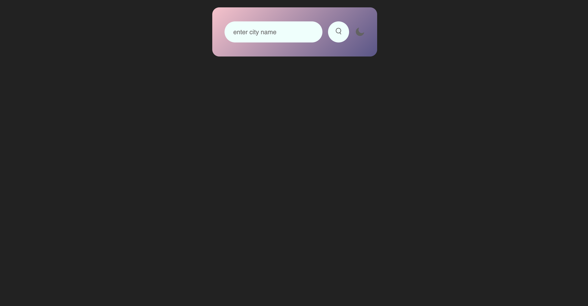
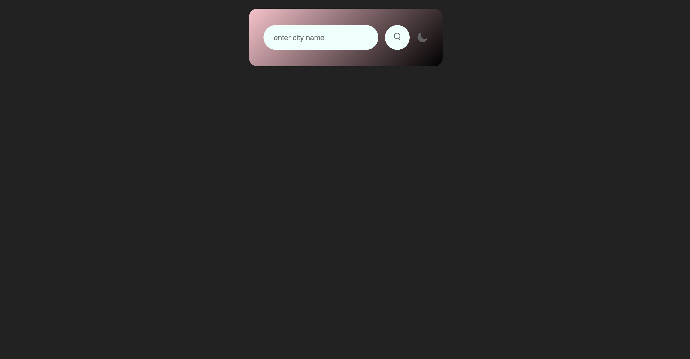
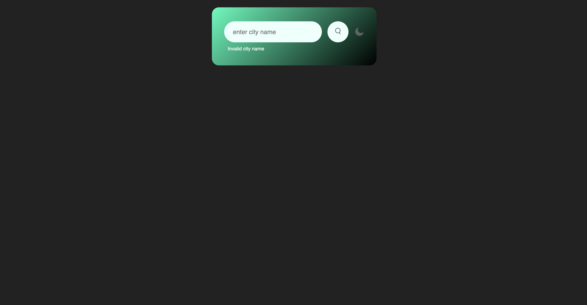
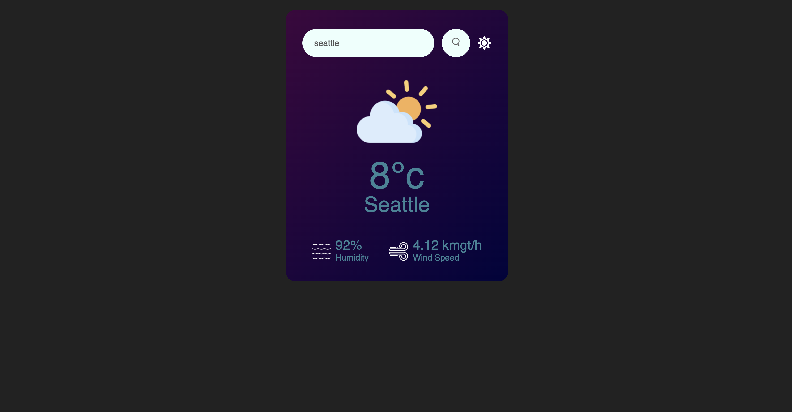
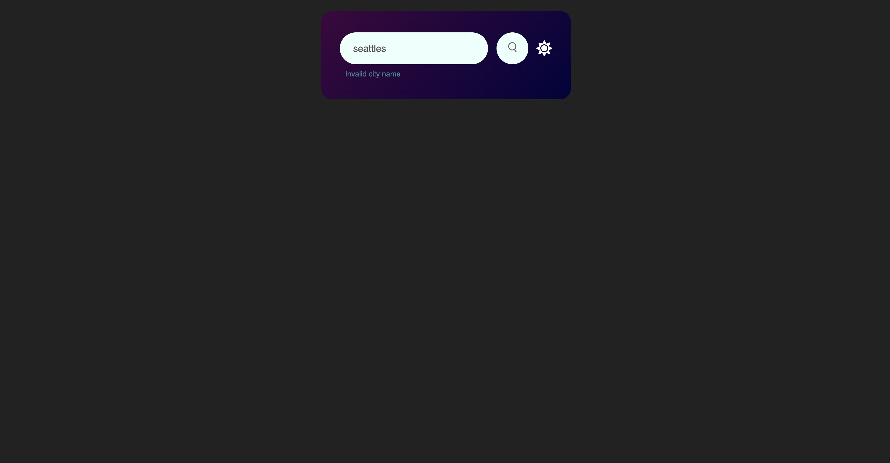
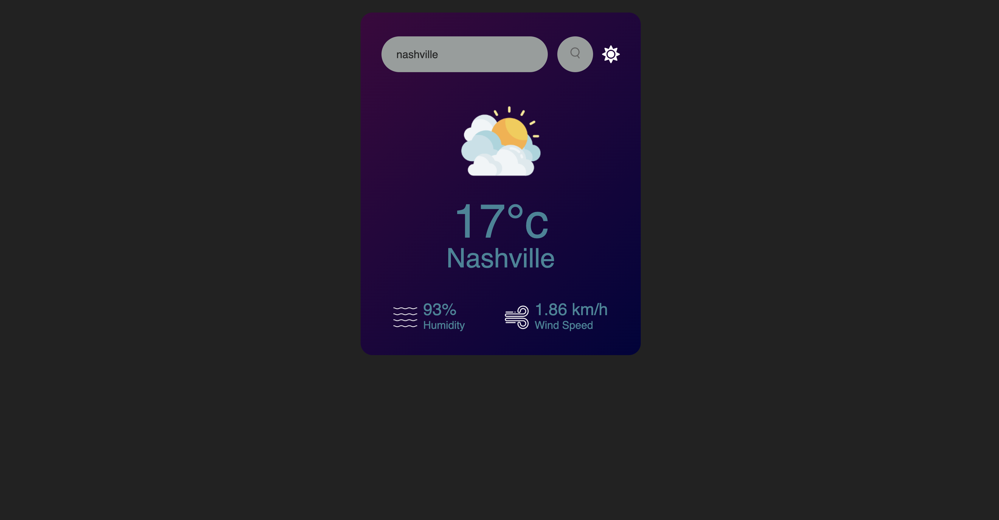

## Overview:

**Version 2: added light to dark mode feature, also based on a [Great Stack tutorial](https://www.youtube.com/watch?v=9LZGB3OLXNQ).

This is a weather reporting app. Users enter the city they want to know about, hit enter or click the search button.  An API call is then sent to Open Weather’s API and the interface is updated with the accurate information.

Based on [this tutorial by Great Stack](https://youtu.be/MIYQR-Ybrn4?si=v9Dg4lY2zpshWA_L). 

## Technologies Used:

HTML, CSS, JavaScript, Open Weather API

## Purpose:

In addition to HTML and CSS practice, I specifically wanted to practice API calls and responses.

These tutorials are great because their CSS always yields modern and beautiful interfaces.  While I follow along I like to pause the video, then write each line of CSS individually while I check the browser for the effect.  This way I can learn the CSS rules holistically as opposed to individually, where I struggle to learn these principles.  Hard to care about justify-content when the examples shown aren’t nice to look at and don’t represent modern coding aesthetic requirements.

It feels like learning how to cook by following a recipe, as opposed to memorizing individual ingredients separately.

My favorite rules in this case are linear gradient, border-radius, and setting the border/outline to 0.  These are seemingly mundane but have a huge effect on the visual appeal of the website.

I also leveraged console.log when making API calls to better understand the cause/effect of changing certain parts of the URL.

## Future Development:

I would love to add a toggle effect for Imperial vs. Metric system displays.

To the input box I also added the ability to hit enter after typing in the city to trigger the API search.  That way users wouldn’t have to leave their keyboard in order to use the app.

I would also like to add click-in functionality to the input box that would highlight the text.

Oh and I would like to add clearing the input box once the search is successful.

Perhaps saving to local storage so your most recent search still displays after refreshing/closing.

## Design Evolution:

Testing the CSS variables with colors I know by name.

Switching slowly back to the original colors while also checking the look of the invalid city error message. 

Settled on a color palette for dark mode, including a font color that's lower contrast.

Lower contrast error message.

Used variables to darken the search input font, and background colors of the input bar and the button. 

